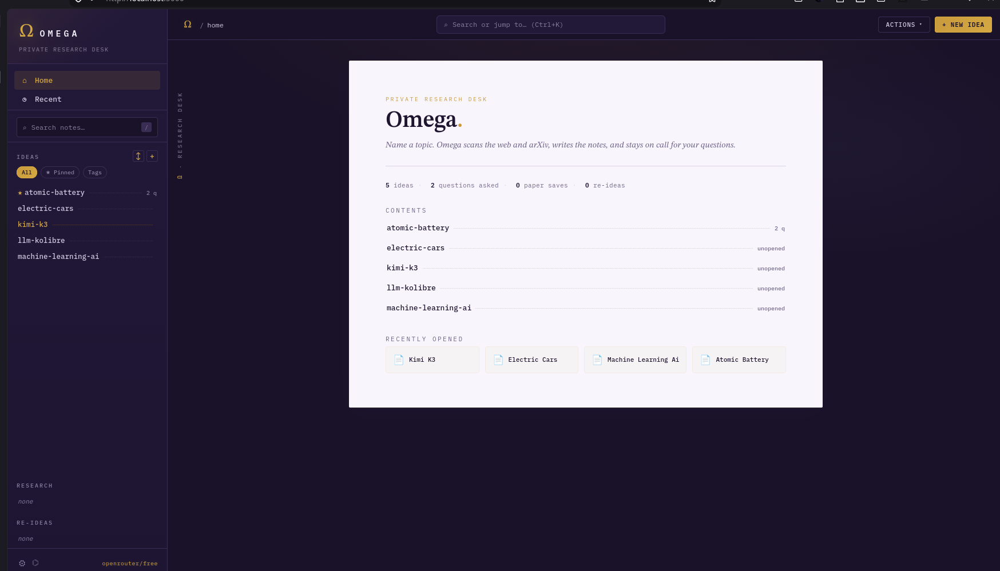
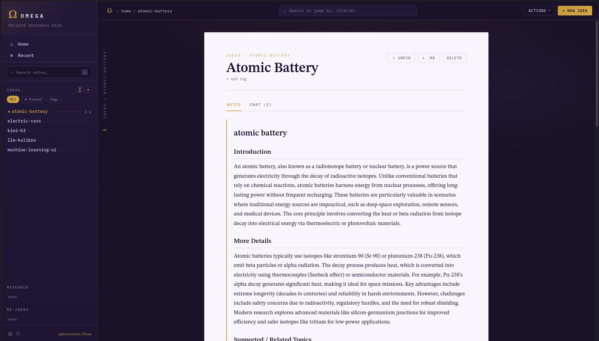
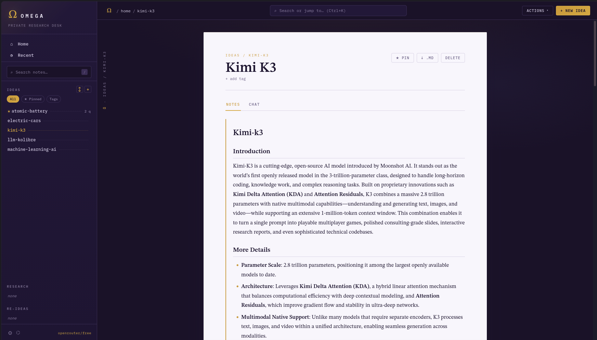
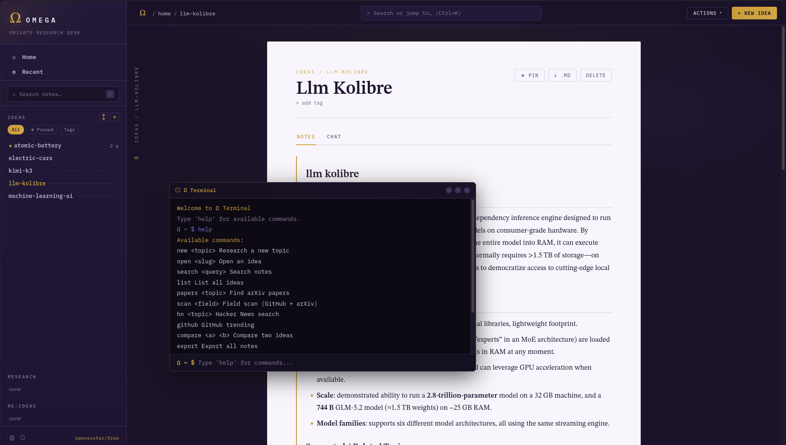

# Omega

> **Omega is a research tool for exploring the web, investigating topics, and organizing information through AI-powered research workflows.**

<p align="center">
  
</p>

---

## Overview

**Omega** is a research-focused tool designed to make web research faster, more organized, and easier to navigate.

It brings web research, AI-assisted analysis, useful research sources, and session management into a single workflow — so you can research a topic without constantly switching between different tools.

Omega can be used through both its **terminal interface** and **web interface**, making it suitable for quick investigations as well as longer research sessions.

---

## Features

- 🔎 **Web Research** — Search and investigate topics using online sources.
- 🤖 **AI Research Assistant** — Ask questions and get AI-assisted explanations.
- 📰 **Hacker News** — Browse and explore current discussions and stories.
- 🐙 **GitHub Trending** — Discover trending repositories.
- 📚 **Research Sessions** — Keep research organized across sessions.
- 💬 **Chat History** — Save and revisit previous conversations.
- 📥 **Downloads** — Export research and session information.
- 🌐 **Web Interface** — Modern browser-based interface for Omega.
- 🖥️ **TUI Support** — Continue using Omega directly from the terminal.
- 🌓 **Dark & Light Themes** — Distinct, polished color palettes with strong contrast.

---

## Screenshots

Add your screenshots to the `images/` directory and update the filenames below.

<table>
  <tr>
    <td>
      
    </td>
    <td>
      
    </td>
  </tr>
  <tr>
    <td>
      
    </td>
    <td>
      
    </td>
  </tr>
</table>

---

## Installation

### Clone the Repository

```bash
git clone https://github.com/YOUR_USERNAME/omega-research.git
cd omega-research
